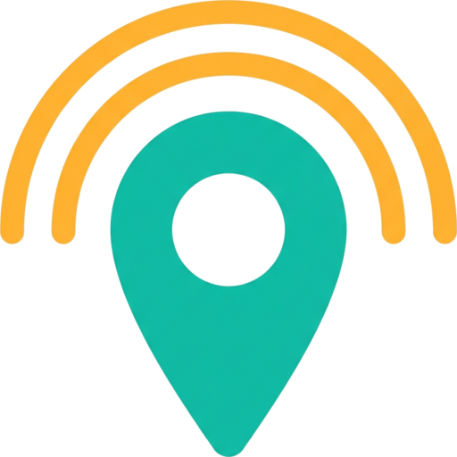

<p align="center">
  
</p>

# FleetServer

[](https://github.com/JohnOlowe/FleetServer/actions/workflows/android.yml)

Turn an Android phone into a **telemetry server for ESP32 GPS trackers**.

The phone listens on its own Wi-Fi network (or its own hotspot) for reports from one or many
ESP32 boards, then plots each tracker — with its latitude, longitude and state — on a map, in the
app. No cloud, no API keys, no account.

## What it does

* Runs a small HTTP server **on the phone** (default port 8080) as a foreground service.
* Accepts `latitude`, `longitude` and device state from any device on the same network:
  * `POST /telemetry` with JSON
  * `GET /telemetry?lat=…&lon=…&state=…`
  * a plain TCP line: `esp32-01,6.52,3.37,4`
* Shows every tracker on a map with a colour-coded pin and its trail:
  * **OSM tiles** (OpenStreetMap, no API key) when the phone has internet
  * **Offline map** — a self-contained latitude/longitude grid that works with no internet at all
    (handy when the ESP32 is joined to the phone's hotspot and the phone is offline)
  * switch between the two with the chip at the top of the map
* Live list of devices with coordinates, packet count and "last seen".
* Traffic log of every accepted (and rejected) packet — handy when bringing up new hardware.
* Shares the map with any laptop on the same network: open `http://<phone-ip>:8080/` in a browser
  and you get a live map (OSM tiles when the browser has internet, a self-contained coordinate grid
  when it doesn't), the device list, trails and follow/fit controls — refreshed every 2 seconds.

## Device states

| Code | State | Pin colour |
| --- | --- | --- |
| 1 | GPS device not found | red |
| 2 | No GPS fix | amber |
| 3 | Offline mode (buffered fix) | blue |
| 4 | Operational | green |

## Quick start

**On the phone**

1. Install the APK (build it with the [Android CI workflow](#building) and download the
   `fleetserver-debug-apk` artifact).
2. Open **FleetServer**. It starts listening straight away; the toolbar shows the port.
3. Tap **⋮ → Connection info** to see the exact URLs your ESP32 should post to
   (e.g. `http://192.168.43.1:8080/telemetry` when the boards are on the phone's hotspot).
4. No hardware yet? Use **⋮ → Simulate a packet** to see the map come alive.

**On the ESP32**

1. Open [`esp32/FleetClient/FleetClient.ino`](esp32/FleetClient/FleetClient.ino).
2. Set `WIFI_SSID` / `WIFI_PASS` to the phone's hotspot (or your router).
3. Set `SERVER_IP` to the address from step 3 above.
4. Leave `SIMULATE_GPS 1` for a first test, then set it to `0` and wire your GPS module to
   the UART pins at the top of the sketch.

**From a laptop on the same network**

```bash
curl -X POST http://192.168.43.1:8080/telemetry \
  -d '{"device":"esp32-01","lat":7.3775,"lon":3.9470,"state":4}'
```

Full protocol and web-dashboard details: [docs/API.md](docs/API.md).

## Watching from a laptop

With the server running, open **http://<phone-ip>:8080/** on any computer on the same network (or
connected to the phone's hotspot). The page is served by the phone itself, so there is nothing to
install: it polls `api/devices?trail=1` and draws pins, trails and the device list. It uses
OpenStreetMap tiles when the laptop has internet and falls back to the built-in grid map when it
does not — the same two modes the app offers.

## Screens and settings

| Where | What |
| --- | --- |
| Map chips | server status, **map source** (OSM / offline), **Follow** and **Fit all** |
| Device list | tap a tracker for details: accuracy, satellites, speed, heading, altitude, source IP, trail length, copy coordinates, centre on map, clear trail, remove |
| ⋮ → Start/Stop server | control the receiver |
| ⋮ → Connection info | endpoints, the web dashboard URL, transport and copy-paste snippets |
| ⋮ → Traffic log | every packet with its timestamp |
| ⋮ → Settings | listening port (1024–65535), auto-start, follow, trails, map source, network info |

## Building

Every push runs **Android CI** (`.github/workflows/android.yml`): it compiles the app with
JDK 17 on `ubuntu-latest`, runs lint, and uploads a downloadable **debug APK** artifact. Only
debug is ever built — there is no release job.

```bash
./gradlew assembleDebug     # debug APK in app/build/outputs/apk/debug/
./gradlew lintDebug         # static checks
```

## Signing

Every build is signed with the keystore kept in `keystore/`, so an APK installed from CI upgrades
cleanly over one built in Android Studio — the signature never changes.

| Property | Value |
| --- | --- |
| `FLEETSERVER_STORE_FILE` | `keystore/damjay_debug.keystore` |
| `FLEETSERVER_KEY_ALIAS` | `photo-triage` |
| `FLEETSERVER_STORE_PASSWORD` / `FLEETSERVER_KEY_PASSWORD` | in `gradle.properties` |

The store is **PKCS12** (what `keytool` writes by default today), and the build detects the type
from the file header, so a JKS file would work too. `storeType`, alias and passwords are all read
in `app/build.gradle.kts` — nothing is hard-coded.

> Heads up: the keystore and its passwords are committed here, in a public repository. That is
> convenient but it means anyone can sign an APK as this app. If this ever ships beyond your own
> devices, move `keystore/` out of git, keep the passwords in a GitHub Actions secret (or a local
> `keystore.properties` that is git-ignored), and generate a fresh upload key.

## Project layout

```
app/src/main/java/damjay/tracker/fleetserver/
  ui/       MainActivity, device list/detail, settings, traffic log
  server/   FleetHttpServer (dependency-free HTTP), FleetServerService (foreground service)
  store/    FleetStore - the fleet, the log and JSON persistence
  map/      OsmFleetMap (OpenStreetMap), OfflineMapView/OfflineFleetMap (tile-free map)
  model/    DeviceState, Telemetry, TrackedDevice, Geo helpers
  util/     NetInfo (local addresses incl. hotspot), Prefs
esp32/FleetClient/          ESP32 sketch (NMEA parsing + reporting, no libraries)
docs/                       API reference, brand assets, interactive UI preview
build-tools/                CI helper: extracts the useful part of a Gradle log
```

## Notes

* Map tiles are © OpenStreetMap contributors; please keep the attribution if you ship the app.
* `0,0` is treated as "no position" so trackers reporting before their first fix do not draw a
  dot in the Atlantic.
* The receiver holds a Wi-Fi lock while running, so the radio stays awake between packets.

## Interactive preview

`docs/preview/index.html` is a self-contained mock of the app UI (no build, no network) — open it
in a browser to see the layout, or press **Simulate a packet** in the preview to watch a tracker
move on the map.
